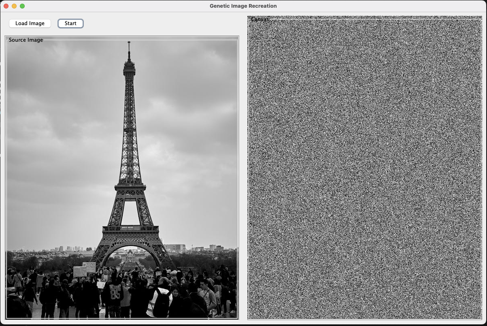

# Genetic Image Recreation

[](https://github.com/vonuyvicoo/genetic-image-recreation/stargazers)
[](https://github.com/vonuyvicoo/genetic-image-recreation/network/members)
[](https://github.com/vonuyvicoo/genetic-image-recreation/issues)
[](https://www.java.com)



## Overview

Genetic Image Recreation is a Java application that uses genetic algorithms to recreate images pixel by pixel. The program analyzes a source image and evolves a solution that attempts to match it using evolutionary computation techniques.

## Features

- Load any image file (JPG, PNG, GIF, BMP)
- Watch the genetic algorithm evolve in real-time
- Adjustable genetic parameters
- Grayscale image recreation

## How It Works

The application uses a genetic algorithm approach to recreate images:

1. The source image is analyzed for pixel brightness values
2. A random initial population of pixels is generated
3. Through multiple generations, the algorithm:
   - Evaluates fitness based on pixel similarity
   - Selects the best-performing pixels
   - Applies genetic operations (mutation, crossover)
   - Gradually improves the match to the source image

## Getting Started

### Prerequisites

- Java Runtime Environment (JRE) 8 or higher

### Running the Application

1. Clone this repository
2. Compile the Java files:
   ```
   javac Main.java
   ```
3. Run the application:
   ```
   java Main
   ```

### Usage

1. Click "Load Image" to select a source image
2. Click "Start" to begin the genetic algorithm process
3. Watch as the image is recreated through evolution

## Sample Images

The `images` directory contains sample images for testing.

## License

This project is open source and available under the MIT License. 